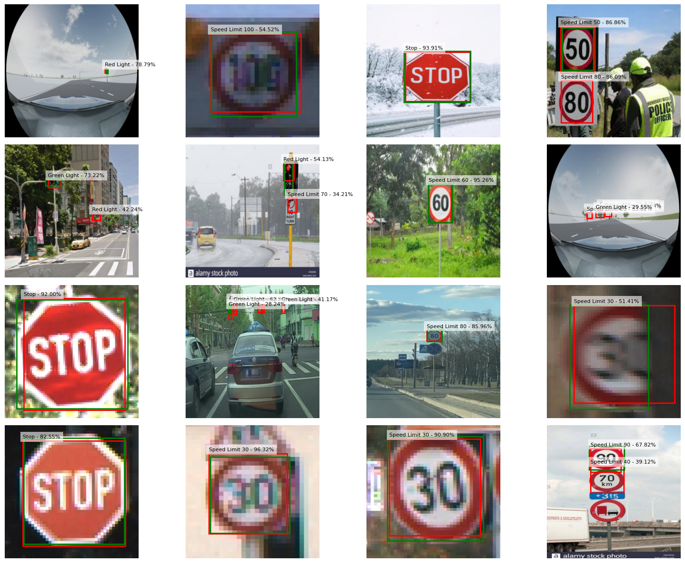

# Traffic Sign Detection via Transfer Learning (YOLOv1-style)

This repository is a learning project, in which an object detector is built from scratch on a pretrained **ResNet50** classification backbone, without using an existing detection library. 
The goal was to actually understand how you get from *classification* to *detection* instead of just using an existing one from a library like `ultralytics`. The task was understanding the model output needed for object detection, modifying the current ResNet50 architecture, implementing the loss function and choosing a working training strategy.



*Red = prediction, green = ground truth. Large signs are localized well, small signs and traffic
lights are harder (see [Results](#results)).*

## What it does

Detects and classifies traffic signs (speed limits, stop sign and traffic lights) in a single forward pass.
The model is a YOLOv1-style detector: a `3×448×448` image goes in and a `20×14×14` tensor comes out. That output is a 14×14 grid of cells, where for each cell 20 numbers are predicted: one objectness score, 4 box values and 15 class scores.

## Approach

The base is strongly inspired by YOLOv1 and therefore kept deliberately simple. The point was not to optimize the architecture, but to get the fine-tuning from classification to detection working. On top of that base there are two intentional changes: a higher input (and therefore higher output) resolution and a different loss function.

**Detection head on ResNet50 backbone:** The ResNet50 IMAGENET1K_V2 weights are taken and the final `avgpool` and `fc` layers are dropped to only keep the convolutional part. The input is doubled to 448×448, which gives a `2048 × 14 × 14` output feature map. On top sits a small detection head, `2× (Conv 3×3 + BatchNorm + ReLU)` followed by a `1×1` convolution that maps to `num_classes + 5 * B = 15 + 5 * 1 = 20` channels. The extra convolution layers give the head some room for the harder task. Unlike YOLOv1, there is no fully connected layer.

**Grid output:** Each of the 14×14 cells predicts one objectness score, a box (`x, y` relative to the cell, `w, h` relative to the image) and 15 class scores. Doubling the input to reach a 14×14 grid instead of YOLOv1's 7×7 (this part is more YOLOv2-style) gives more cells, which means fewer collisions when objects sit close together, and more spatial detail. With `B = 1` a cell can only describe one object, which is the main simplification, but kept on purpose to focus on the fine-tuning, not on architecture tricks like anchors. Also with the higher grid resolution and larger detection head only the implementation of anchors would probably noticeably improve the network.

**Composite loss** (each term weighted, since they live on different scales):
- **Objectness**: sigmoid + BCE, with empty cells weighted less (as far more cells are empty than not).
- **Classification**: softmax + cross-entropy, only on cells that contain an object.
- **Localization**: GIoU plus an extra L2 penalty on `sqrt(w)`, `sqrt(h)` also only on cells containing an object. The reason for the L2 penalty is, that with GIoU alone the box tends to stay large with the GT box often sitting inside it (or the other way round). There, GIoU is roughly IoU and the loss barely moves (a near-zero-gradient plateau) and when breaking out jumps too far, collapsing the boxes. The L2 term pushes width and height down and gets training off that plateau, after which GIoU becomes useful again.

**Two-stage training:**
1. Freeze the backbone, train only the new head.
2. Unfreeze everything and fine-tune the whole network with a lower learning rate.

Training and validation losses were logged to **Weights & Biases**.

**Augmentation** uses torchvision `v2` transforms that transform the bounding boxes along with the
image (random resized crop, perspective, color jitter, grayscale).

**Inference** filters the raw grid predictions with **NMS** (non-maximum suppression) so each object ends up with (mostly) a single box.

## Results

Evaluated on the held-out test split with COCO-style mAP (`torchmetrics`).

| Metric | Value |
|---|---|
| mAP@0.5:0.95 | 0.45 |
| mAP@0.5 | 0.68 |
| mAP@0.75 | 0.52 |

By object size:

| Size | mAP | Recall (mAR@100) |
|---|---|---|
| Large | 0.69 | 0.74 |
| Medium | 0.39 | 0.45 |
| Small | 0.09 | 0.16 |

Validation loss per training stage:

| Stage | Val loss |
|---|---|
| Head only (frozen backbone) | 1.53 |
| Full fine-tune (unfrozen) | 1.18 |

**Reading the numbers.** These mAP values are averaged over IoU 0.5 to 0.95, so they reward tight boxes, not only correct detections. The drop from mAP@0.5 (0.68) to mAP@0.75 (0.52) shows the boxes are placed well but not pixel-exact. 

One limitation of the dataset: some images annotate only one sign even when several are visible. The model often finds the extra ones, which then count as false positives, so the precision numbers are a bit pessimistic.

## Dataset

[Self-Driving Cars](https://universe.roboflow.com/selfdriving-car-qtywx/self-driving-cars-lfjou/dataset/6)
(Roboflow, CC BY 4.0), also mirrored on [Kaggle](https://www.kaggle.com/datasets/pkdarabi/cardetection).
~4969 images, 15 classes (traffic lights, speed limits 10–120, stop), YOLO format. It is included in
this repo under `data/Traffic_Sign/car/` (`train/`, `valid/`, `test/`, each with `images/` + `labels/`,
plus `data.yaml`), so no download is needed.

## Project structure

```
assets/                           images used in this README
best_models/                      trained checkpoints (*.pth, gitignored, via Releases)
data/                             the traffic sign dataset (train/valid/test + data.yaml)
helper/                           utils.py: dataset, model, loss, train/eval loops, visualization
01_Inspect_Original_Model.ipynb   inspect ResNet50, test its classification on the traffic sign data
02_Build_Model_And_Test.ipynb     build and add the detection head, define the loss, overfit one batch for verification
03_Train_Model_Head.ipynb         train the head with a frozen backbone
04_Train_Unfrozen_Model.ipynb     fine-tune the whole unfrozen network
05_Inference.ipynb                NMS inference, visualization, mAP evaluation
README.md                         this file
```

## Setup

Python 3.13, [uv](https://docs.astral.sh/uv/) for dependencies:

```bash
uv sync
```

The dataset is already included under `data/Traffic_Sign/car/`, so no download is needed. The trained
weights (`best_models/*.pth`, ~400 MB) are gitignored, so download them from the repo's Releases and
put them in `best_models/`, or retrain with notebooks 03 and 04.

## Limitations & next steps

- **One object per cell.** With `B = 1` the grid can't separate objects whose centers land in the
  same cell. Using anchors to be able predict multiple boxes per cell would help.
- **Small objects are weak** (`mAP_small = 0.09`). A small box's IoU reacts strongly to tiny errors
  in the predicted center offset and in the `w`/`h` regression, so it needs very precise localization,
  which the coarse 14×14 grid makes hard. For example finer features, or like YOLOv2 training on different 
  image sizes, as well as anchors, would help to add spatial precision.
- **Class imbalance.** Rare classes (traffic lights) are under-detected. Class-balanced sampling or
  a focal-style loss could rebalance this.
- **Model selection on val loss, not mAP.** The best checkpoint is picked by validation loss. Selecting on mAP would align better with detection quality (validation loss was used as a simplification for shorter training times).
